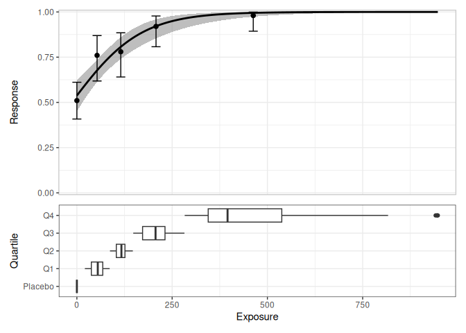
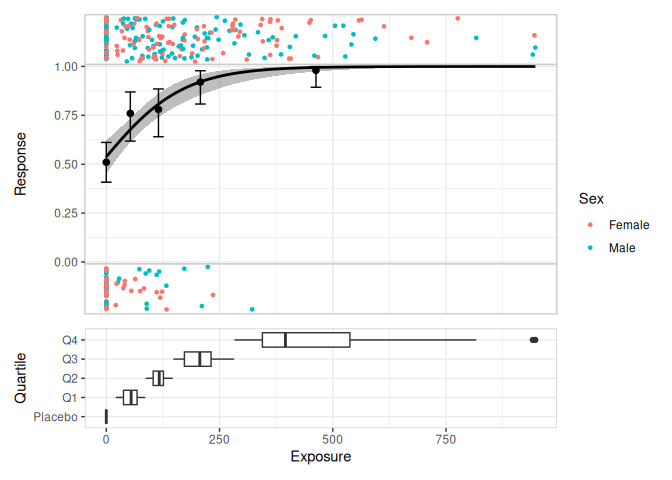
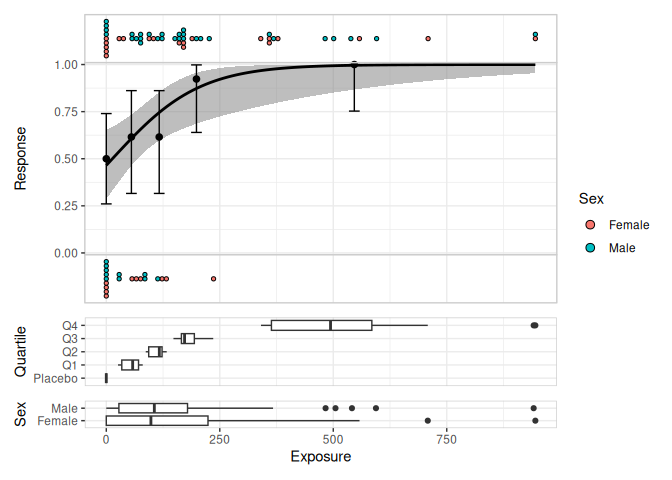
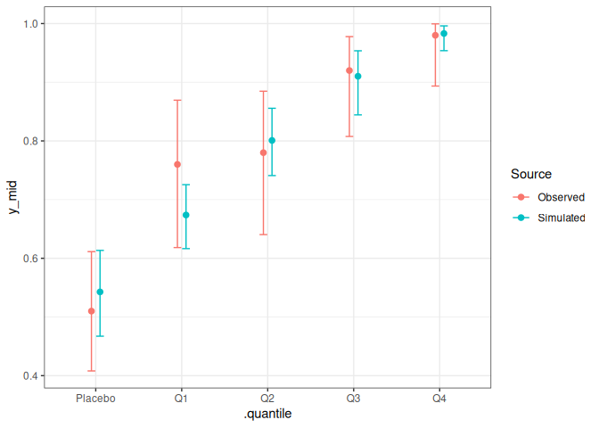
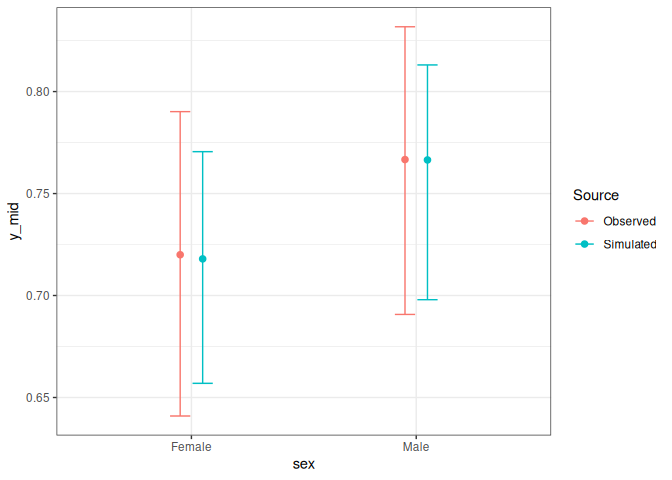

<!-- README.md is generated from README.Rmd. Please edit that file -->

# erlr

<!-- badges: start -->

[](https://github.com/djnavarro/erlr/actions/workflows/R-CMD-check.yaml)
<!-- badges: end -->

Provides estimation and plotting tools for exposure-response models that
use logistic regression for binary responses. It is mostly intended as a
convenience package: the core tools are wrappers around `glm()`, and the
plotting tools use ggplot2 and patchwork to build typical plots used in
exposure-response modelling.

## Installation

You can install the development version of erlr like so:

``` r
pak::pak("djnavarro/erlr")
```

## Example

``` r
library(erlr)
library(dplyr)
#> 
#> Attaching package: 'dplyr'
#> The following objects are masked from 'package:stats':
#> 
#>     filter, lag
#> The following objects are masked from 'package:base':
#> 
#>     intersect, setdiff, setequal, union
library(tibble)

lr_data
#> # A tibble: 300 × 6
#>       id  dose exposure quartile response sex   
#>    <int> <dbl>    <dbl> <fct>       <dbl> <fct> 
#>  1     1   100    148.  Q3              1 Male  
#>  2     2   100     79.7 Q1              1 Male  
#>  3     3   200    212.  Q3              1 Male  
#>  4     4   200    236.  Q3              0 Female
#>  5     5     0      0   Placebo         1 Female
#>  6     6   200     71.0 Q1              1 Male  
#>  7     7   100    173.  Q3              1 Male  
#>  8     8   100    123.  Q2              0 Female
#>  9     9     0      0   Placebo         0 Male  
#> 10    10   200    165.  Q3              1 Male  
#> # ℹ 290 more rows

mod <- lr_model(response ~ exposure, lr_data)
mod
#> 
#> Call:  stats::glm(formula = formula, family = stats::binomial(link = "logit"), 
#>     data = data)
#> 
#> Coefficients:
#> (Intercept)     exposure  
#>     0.15078      0.01112  
#> 
#> Degrees of Freedom: 299 Total (i.e. Null);  298 Residual
#> Null Deviance:       341.7 
#> Residual Deviance: 283.9     AIC: 287.9

lr_data |> 
  lr_plot(exposure, response) |> 
  lr_plot_add_quantiles(bins = 4) |> 
  lr_plot_add_boxplot(group_by = quartile) |> 
  print()
#> Warning: annotation$theme is not a valid theme.
#> Please use `theme()` to construct themes.
```



``` r

lr_data |> 
  lr_plot(exposure, response) |> 
  lr_plot_add_quantiles(bins = 4) |> 
  lr_plot_add_jitter_strips(color_by = sex) |> 
  lr_plot_add_boxplot(group_by = quartile) |> 
  print()  
#> Warning: annotation$theme is not a valid theme.
#> Please use `theme()` to construct themes.
```



``` r

lr_data[1:70,] |> 
  lr_plot(exposure, response) |> 
  lr_plot_add_quantiles(bins = 4) |> 
  lr_plot_add_dotplot_strips(color_by = sex) |> 
  lr_plot_add_boxplot(group_by = quartile) |> 
  lr_plot_add_boxplot(group_by = sex) |> 
  print(box_height = 2)
#> Warning: annotation$theme is not a valid theme.
#> Please use `theme()` to construct themes.
```



``` r

mod <- lr_model(response ~ exposure + sex, lr_data)
sim <- lr_vpc_sim(mod)
sim
#> # A tibble: 30,000 × 5
#>    response exposure sex    row_id sim_id
#>       <dbl>    <dbl> <fct>   <int>  <int>
#>  1    0.891    148.  Male        1      1
#>  2    0.789     79.7 Male        2      1
#>  3    0.945    212.  Male        3      1
#>  4    0.962    236.  Female      4      1
#>  5    0.627      0   Female      5      1
#>  6    0.772     71.0 Male        6      1
#>  7    0.917    173.  Male        7      1
#>  8    0.874    123.  Female      8      1
#>  9    0.600      0   Male        9      1
#> 10    0.909    165.  Male       10      1
#> # ℹ 29,990 more rows

lr_vpc_plot(mod, sim, group_by = exposure)
```



``` r
lr_vpc_plot(mod, sim, group_by = sex)
```


