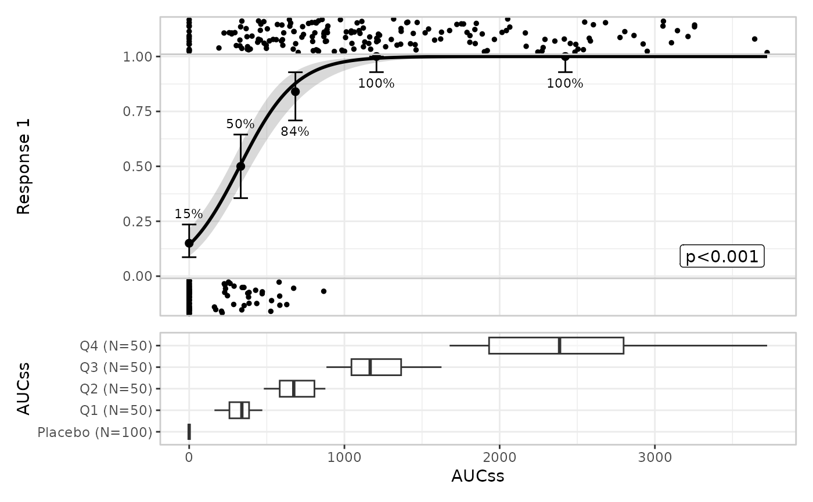
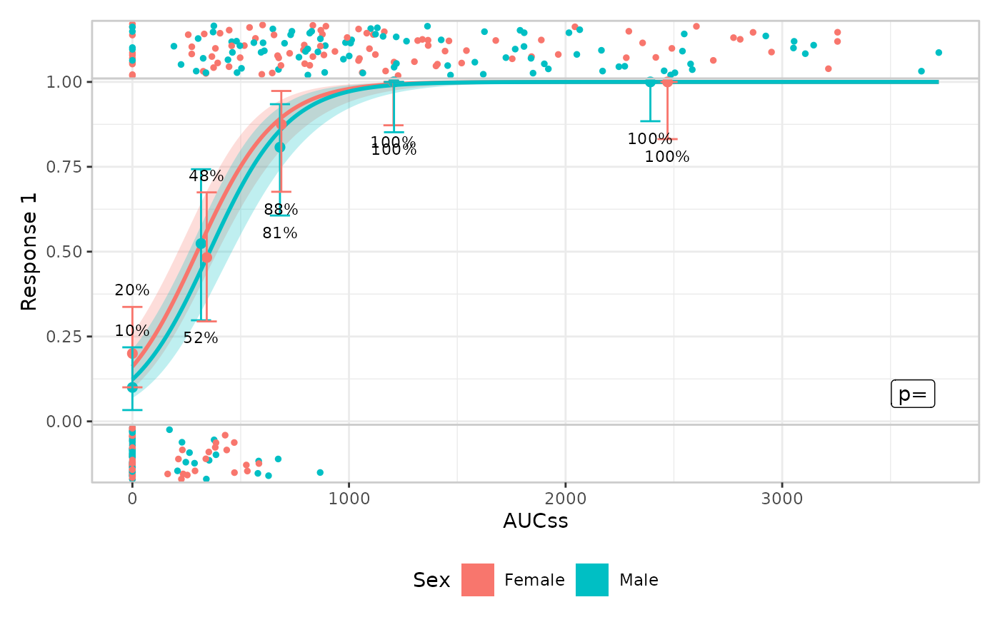
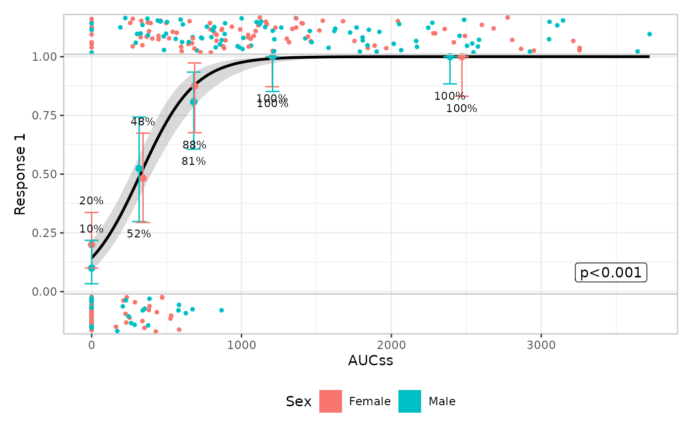
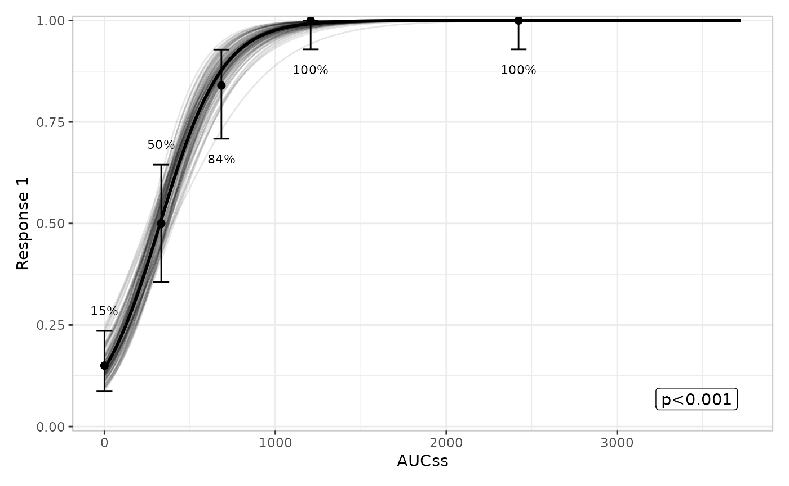
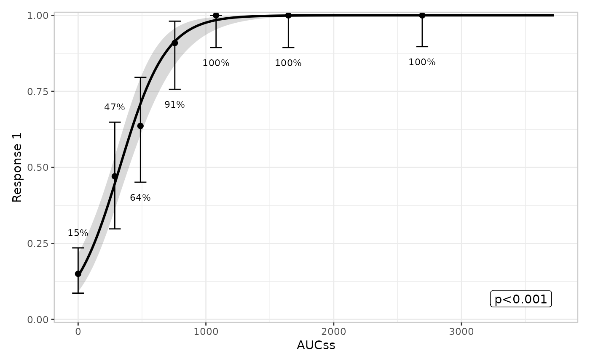
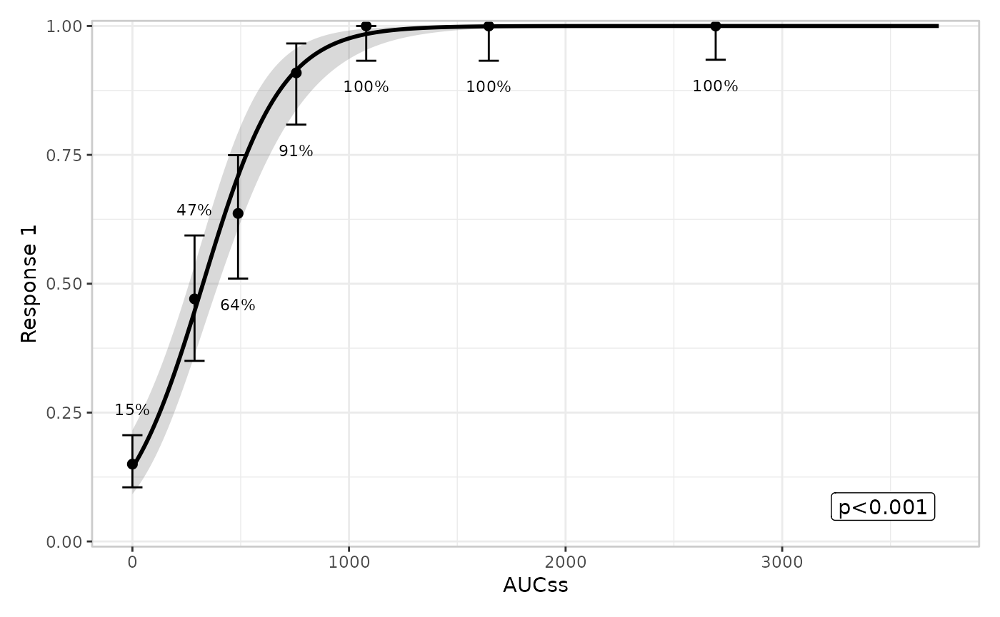
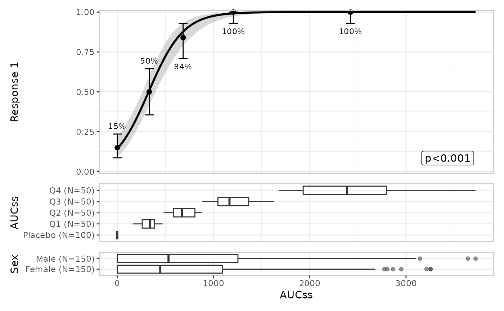
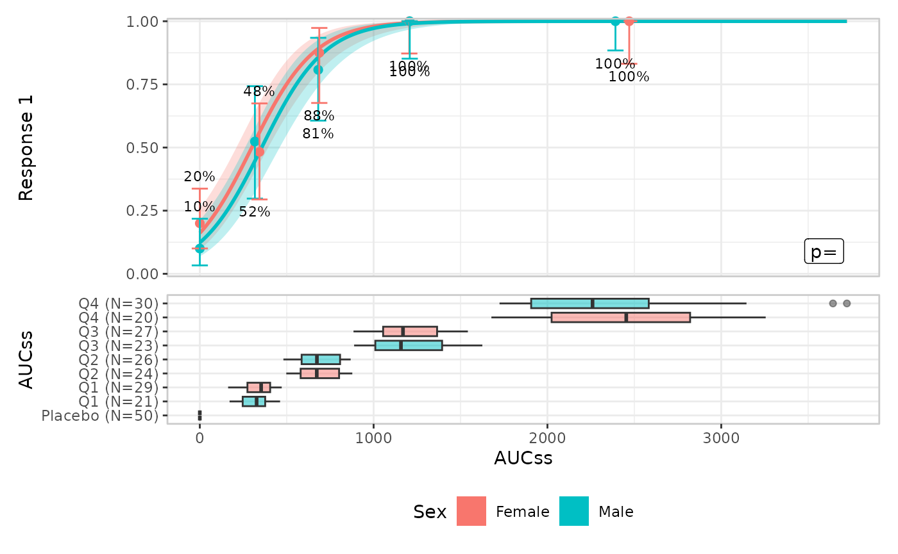

# Plotting

This is the plotting article

``` r
library(erlr)
```

## Defining plots

Basic usage

``` r
lr_data |> 
  lr_plot(exposure = aucss, response = ae1) |> 
  lr_plot_show_model() |> 
  lr_plot_show_quantiles() |> 
  plot()
```


Adding extra components

``` r
lr_data |> 
  lr_plot(exposure = aucss, response = ae1) |> 
  lr_plot_show_model() |> 
  lr_plot_show_quantiles() |>
  lr_plot_show_datastrip() |>
  lr_plot_show_groups(group_by = aucss) |> 
  plot()
```



## Stratification

Stratification adds colour across all components

``` r
lr_data |> 
  lr_plot(
    exposure = aucss, 
    response = ae1, 
    stratify_by = sex
  ) |> 
  lr_plot_show_model() |> 
  lr_plot_show_quantiles() |> 
  lr_plot_show_datastrip() |>
  plot()
```



You can suppress stratification for specific components

``` r
lr_data |> 
  lr_plot(
    exposure = aucss, 
    response = ae1, 
    stratify_by = sex
  ) |> 
  lr_plot_show_model(keep_strata = FALSE) |> 
  lr_plot_show_quantiles() |> 
  lr_plot_show_datastrip() |>
  plot()
```



## Model component

Default is `style = "ribbonline"` but you can also draw spaghetti plots
to represent parameter uncertainty

``` r
lr_data |> 
  lr_plot(aucss, ae1) |> 
  lr_plot_show_model(style = "spaghetti") |> 
  lr_plot_show_quantiles() |> 
  plot()
#> Using seed = 4371
#> Warning in ggplot2::geom_path(data = sim, mapping = ggplot2::aes(x =
#> .data[[exposure$name]], : Ignoring unknown parameters: `fill`
```



## Quantile component

You can modify the number of bins:

``` r
lr_data |> 
  lr_plot(aucss, ae1) |> 
  lr_plot_show_model() |> 
  lr_plot_show_quantiles(bins = 6) |> 
  plot()
```



You can also modify the confidence level for the Clopper-Pearson
interval:

``` r
lr_data |> 
  lr_plot(aucss, ae1) |> 
  lr_plot_show_model() |> 
  lr_plot_show_quantiles(bins = 6, conf_level = .8) |> 
  plot()
```



## Strip component

## Group component

Multiple grouping variables are allowed:

``` r
lr_data |> 
  lr_plot(aucss, ae1) |> 
  lr_plot_show_model() |> 
  lr_plot_show_quantiles() |>
  lr_plot_show_groups(group_by = c(aucss, sex)) |> 
  plot()
```



Stratification propagates to the group component:

``` r
lr_data |> 
  lr_plot(aucss, ae1, stratify_by = sex) |> 
  lr_plot_show_model() |> 
  lr_plot_show_quantiles() |>
  lr_plot_show_groups(group_by = aucss) |> 
  plot()
```



The default is `style = "boxplot"` but you can also use violin plots:

``` r
lr_data |> 
  lr_plot(aucss, ae1) |> 
  lr_plot_show_model() |> 
  lr_plot_show_quantiles() |>
  lr_plot_show_groups(group_by = sex, style = "violin") |> 
  plot()
```


