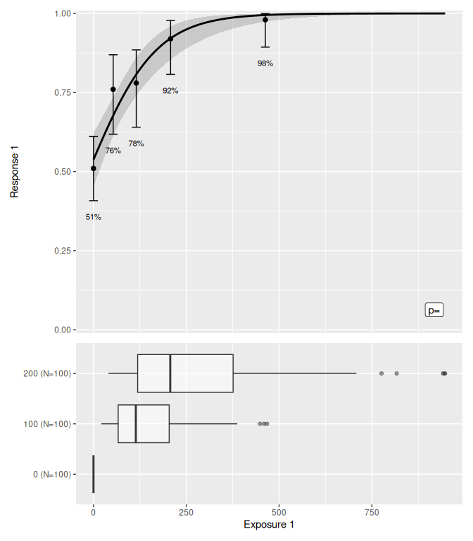
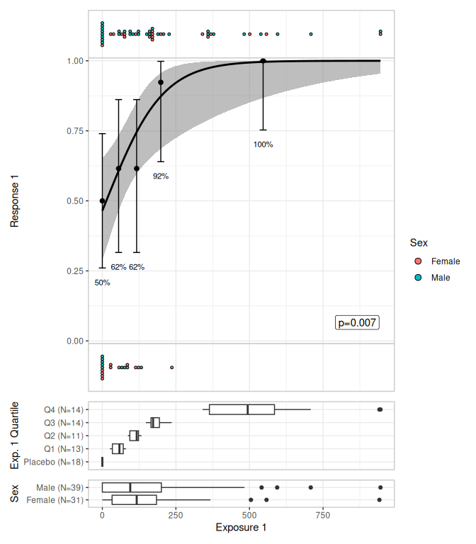
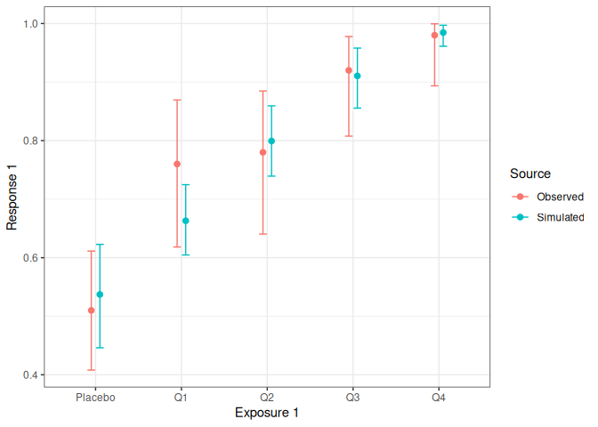

# erlr

Provides estimation and plotting tools for exposure-response models that
use logistic regression for binary responses. It is mostly intended as a
convenience package: the core tools are wrappers around
[`glm()`](https://rdrr.io/r/stats/glm.html), and the plotting tools use
ggplot2 and patchwork to build typical plots used in exposure-response
modelling.

## Installation

You can install the development version of erlr like so:

``` r
pak::pak("djnavarro/erlr")
```

## Models

``` r
library(erlr)
library(dplyr)
#> 
#> Attaching package: 'dplyr'
#> The following objects are masked from 'package:stats':
#> 
#>     filter, lag
#> The following objects are masked from 'package:base':
#> 
#>     intersect, setdiff, setequal, union
library(tibble)

lr_data
#> # A tibble: 300 × 7
#>       id  dose exposure_1 quartile_1 response_1 response_2 sex   
#>    <int> <dbl>      <dbl> <fct>           <dbl>      <dbl> <fct> 
#>  1     1   100      148.  Q3                  1          1 Male  
#>  2     2   100       79.7 Q1                  1          0 Male  
#>  3     3   200      212.  Q3                  1          0 Male  
#>  4     4   200      236.  Q3                  0          0 Female
#>  5     5     0        0   Placebo             1          0 Male  
#>  6     6   200       71.0 Q1                  1          0 Female
#>  7     7   100      173.  Q3                  1          0 Male  
#>  8     8   100      123.  Q2                  0          0 Female
#>  9     9     0        0   Placebo             0          0 Male  
#> 10    10   200      165.  Q3                  1          0 Female
#> # ℹ 290 more rows

mod <- lr_model(response_1 ~ exposure_1, lr_data)
mod
#> 
#> Call:  stats::glm(formula = formula, family = stats::binomial(link = "logit"), 
#>     data = data)
#> 
#> Coefficients:
#> (Intercept)   exposure_1  
#>     0.15078      0.01112  
#> 
#> Degrees of Freedom: 299 Total (i.e. Null);  298 Residual
#> Null Deviance:       341.7 
#> Residual Deviance: 283.9     AIC: 287.9
```

## Plots

``` r
lr_data |> 
  lr_plot(exposure_1, response_1) |> 
  lr_plot_add_quantiles(bins = 4) |> 
  lr_plot_add_boxplot(group_by = quartile_1) |> 
  print()
#> Warning: annotation$theme is not a valid theme.
#> Please use `theme()` to construct themes.
```



``` r

lr_data |> 
  lr_plot(exposure_1, response_1) |> 
  lr_plot_add_quantiles(bins = 4) |> 
  lr_plot_add_jitter_strips(color_by = sex) |> 
  lr_plot_add_boxplot(group_by = quartile_1) |> 
  print()  
#> Warning: annotation$theme is not a valid theme.
#> Please use `theme()` to construct themes.
```


``` r

lr_data[1:70,] |> 
  lr_plot(exposure_1, response_1) |> 
  lr_plot_add_quantiles(bins = 4) |> 
  lr_plot_add_dotplot_strips(color_by = sex) |> 
  lr_plot_add_boxplot(group_by = quartile_1) |> 
  lr_plot_add_boxplot(group_by = sex) |> 
  print(box_height = 2)
#> Warning: annotation$theme is not a valid theme.
#> Please use `theme()` to construct themes.
```



## Stepwise covariate modelling

``` r
mod1 <- lr_model(response_1 ~ exposure_1 + sex + dose, lr_data)
mod2 <- lr_scm_backward(mod1, candidates = c("sex", "dose"))
lr_scm_history(mod2)
#> # A tibble: 4 × 11
#>   iteration attempt step       action term_tested model_tested   model_converged
#>       <int>   <int> <chr>      <chr>  <chr>       <chr>          <lgl>          
#> 1         0       0 base model <NA>   <NA>        response_1 ~ … TRUE           
#> 2         1       1 backward   remove ~dose       response_1 ~ … TRUE           
#> 3         1       2 backward   remove ~sex        response_1 ~ … TRUE           
#> 4         2       3 backward   remove ~sex        response_1 ~ … TRUE           
#> # ℹ 4 more variables: term_p_value <dbl>, model_aic <dbl>, model_bic <dbl>,
#> #   model_updated <int>
```

## VPC/Simulation

``` r
mod <- lr_model(response_1 ~ exposure_1 + sex, lr_data)
sim <- lr_vpc_sim(mod)
sim
#> # A tibble: 30,000 × 5
#>    response_1 exposure_1 sex    row_id sim_id
#>         <dbl>      <dbl> <fct>   <int>  <int>
#>  1      0.896      148.  Male        1      1
#>  2      0.804       79.7 Male        2      1
#>  3      0.945      212.  Male        3      1
#>  4      0.919      236.  Female      4      1
#>  5      0.633        0   Male        5      1
#>  6      0.653       71.0 Female      6      1
#>  7      0.919      173.  Male        7      1
#>  8      0.769      123.  Female      8      1
#>  9      0.633        0   Male        9      1
#> 10      0.840      165.  Female     10      1
#> # ℹ 29,990 more rows

lr_vpc_plot(mod, sim, group_by = exposure_1)
```



``` r
lr_vpc_plot(mod, sim, group_by = sex)
```


